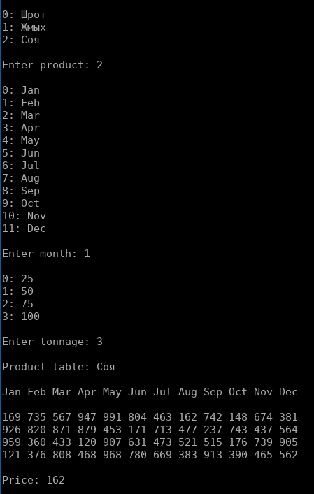
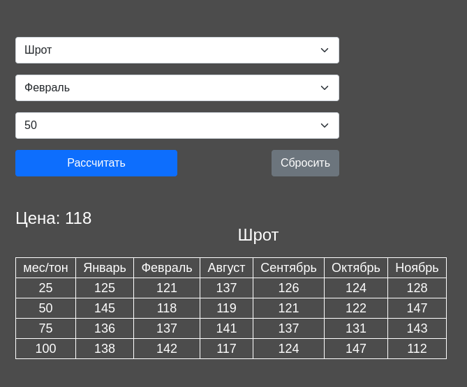

# Калькулятор начальной стоимости предложения

## Условие:
Даны 3 таблицы сырья.
В каждой строке расположена стоимость данного сырья в зависимости от месяца и количества тон.

### Шрот
| мес/тон | январь | февраль | март | апрель | май | июнь | июль | август | сентябрь | октябрь | ноябрь | декабрь |
|---------|--------|---------|------|--------|-----|------|------|--------|----------|---------|--------|---------|
| 25      | 394    | 830     | 957  | 216    | 618 | 947  | 178  | 103    | 705      | 839     | 518    | 968     |
| 50      | 307    | 603     | 795  | 657    | 159 | 973  | 690  | 580    | 929      | 944     | 994    | 416     |
| 75      | 709    | 298     | 761  | 976    | 740 | 926  | 516  | 794    | 918      | 372     | 882    | 276     |
| 100     | 399    | 309     | 531  | 192    | 676 | 194  | 399  | 294    | 927      | 471     | 670    | 635     |

### Жмых
| мес/тон | январь | февраль | март | апрель | май | июнь | июль | август | сентябрь | октябрь | ноябрь | декабрь |
|---------|--------|---------|------|--------|-----|------|------|--------|----------|---------|--------|---------|
| 25      | 946    | 603     | 398  | 234    | 885 | 150  | 936  | 633    | 311      | 902     | 267    | 278     |
| 50      | 160    | 285     | 101  | 876    | 234 | 593  | 370  | 302    | 194      | 791     | 257    | 201     |
| 75      | 195    | 776     | 291  | 503    | 328 | 669  | 525  | 692    | 422      | 778     | 988    | 898     |
| 100     | 724    | 989     | 713  | 167    | 456 | 406  | 628  | 456    | 634      | 679     | 540    | 959     |

### Соя
| мес/тон | январь | февраль | март | апрель | май | июнь | июль | август | сентябрь | октябрь | ноябрь | декабрь |
|---------|--------|---------|------|--------|-----|------|------|--------|----------|---------|--------|---------|
| 25      | 169    | 991     | 742  | 926    | 453 | 237  | 959  | 907    | 515      | 121     | 968    | 913     |
| 50      | 735    | 804     | 148  | 820    | 171 | 743  | 360  | 631    | 176      | 376     | 780    | 390     |
| 75      | 567    | 463     | 674  | 871    | 713 | 437  | 433  | 473    | 739      | 808     | 669    | 465     |
| 100     | 947    | 162     | 381  | 879    | 477 | 564  | 120  | 521    | 905      | 468     | 383    | 562     |

## Задание:
Написать консольное и веб приложение которое возвращает цену согласно выбранных параметров - сырья, месяца, тонажа

### Примеры интерфейсов:

Консольное:

Веб:

